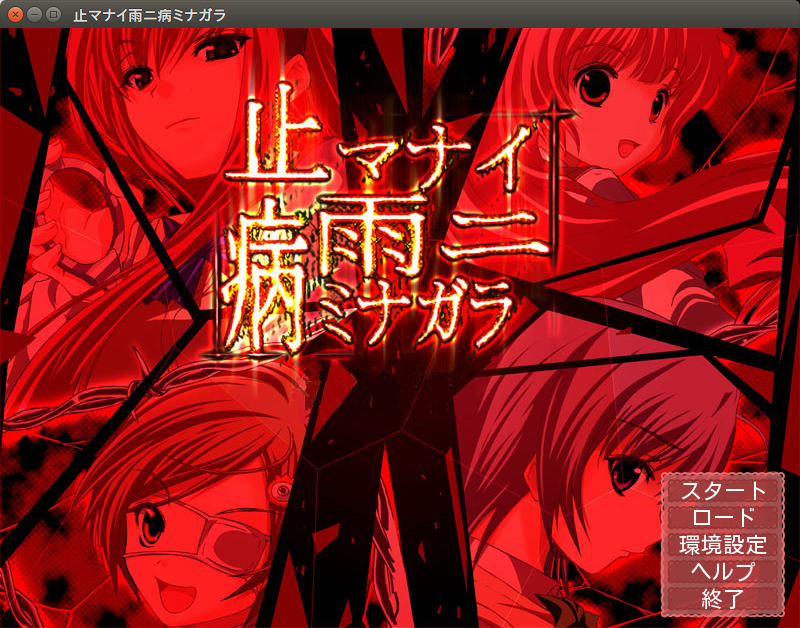
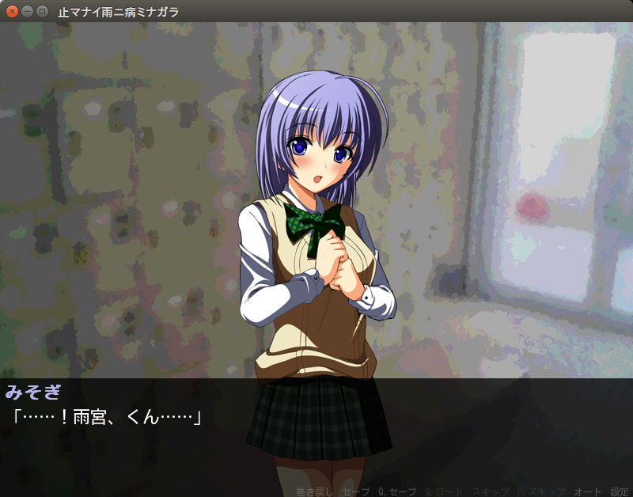

# Yamayami
Yamayami(ヤマヤミ/止マナイ雨ニ病ミナガラ) ported to Ren'Py.

**ヤマヤミ**こと**[止マナイ雨ニ病ミナガラ](https://www58.atwiki.jp/yandere01/pages/1.html "ヒロインが全員ヤンデレなギャルゲ作ろうぜまとめ　@ ウィキ - 止マナイ雨ニ病ミナガラ制作まとめ")**をRen'Pyに移植するプロジェクト．

## Getting started

```bash
# Clone project
git clone git://github.com/mikoim/yamayami.git

# Move yamayami to your Ren'Py project directory
mv yamayami $YOUR_PROJECT_DIRECTORY

# Linux / Other
renpy.sh

# Windows
renpy.exe
```

## Demo



